<div align="center">
  
# 👋 Hi there, I'm Gaurav Surtani!

### 🎯 Full-Stack AI Developer | Data Engineer | ML Enthusiast


</div>

---

## 🚀 About Me

```python
class GauravSurtani:
    def __init__(self):
        self.name = "Gaurav Surtani"
        self.location = "San Jose, CA 🌉"
        self.current_work = ["Bexorg", "NASA", "SJSU RF"]
        self.current_focus = "Full-Stack AI Development"
        self.interests = ["AI/ML", "Data Engineering", "NLP", "Knowledge Graphs"]
        self.hobbies = ["Building Chrome Extensions", "Data Science", "Open Source"]
    
    def say_hi(self):
        print("Thanks for dropping by! Let's build something amazing together 🚀")

me = GauravSurtani()
me.say_hi()
```

🔭 **Currently working on:** Building intelligent solutions that bridge AI and practical applications  
🌱 **Learning:** Advanced ML techniques, Agentic AI systems, and modern web technologies  
💡 **Passionate about:** Creating tools that solve real-world problems using data and AI  
🎯 **2024 Goal:** Become a well-rounded Full-Stack AI Developer  

---

## 🛠️ Tech Stack & Tools

### 🧠 AI & Data Science


### 💻 Development


### 🔧 Tools & Platforms


---

## 📊 GitHub Stats

<div align="center">
  
[](https://github.com/gauravsurtani)

[](https://github.com/gauravsurtani)

[](https://github.com/gauravsurtani)

</div>

---

## 🏆 Featured Projects

### 🔗 [Email-Link](https://github.com/gauravsurtani/Email-Link)
**NLP + Knowledge Graphs + Agentic AI**  
Advanced email management system that helps users find everything in their email using cutting-edge AI technologies.

### 🍽️ [wat-to-eat](https://github.com/gauravsurtani/wat-to-eat) 
**Data Engineering + Food Analytics**  
Data engineering project analyzing Food.com tags to recommend the best food for your taste preferences.

### 📊 [company-stats](https://github.com/gauravsurtani/company-stats)
**Job Market Analysis + Data Science**  
Synthesizing Simplify and H1B grader data to find interesting trends in the job market over recent years.

### 🔥 [fire-prediction](https://github.com/gauravsurtani/fire-prediction) ⭐ 4
**Machine Learning + Environmental Science**  
Forest fire prediction using weather variables with comprehensive data science workflows.

### 🎬 [youtube-history-extension](https://github.com/gauravsurtani/youtube-history-extension)
**Chrome Extension + Web APIs**  
Innovative solution to access YouTube history bypassing API limitations.

---

## 📈 Contribution Graph

<div align="center">
  
[](https://github.com/gauravsurtani)

</div>

---

## 🎯 Current Focus

```mermaid
graph LR
    A[🧠 AI Research] --> D[🚀 Full-Stack AI]
    B[📊 Data Engineering] --> D
    C[💻 Web Development] --> D
    D --> E[🌟 Intelligent Solutions]
```



**2024 Roadmap:**
- 🔬 Deep dive into Agentic AI systems
- 🛠️ Build more production-ready AI applications  
- 📚 Contribute to open-source AI projects
- 🌐 Expand full-stack development skills

---

## 🏅 Achievements & Recognition

<div align="center">

[](https://github.com/gauravsurtani)

</div>

**GitHub Achievements:**
- 🎯 **YOLO** - Merged pull request without code review
- 🦈 **Pull Shark** - Opened quality pull requests

---

## 📫 Let's Connect!

<div align="center">

[](https://linkedin.com/in/gaurav-surtani)
[](https://github.com/gauravsurtani)
[](mailto:gaurav.surtani@gmail.com)

</div>

---

## 💡 Fun Facts

- 🤖 I love building AI solutions that actually solve real problems
- 🔍 Always curious about the latest developments in AI research  
- 🌮 Data engineering with food data? Yes, please! (Check out wat-to-eat)
- 🔥 Predicting forest fires with ML because why not save the planet?
- 📧 Built an AI system to manage emails because inbox zero is the dream

---

<div align="center">

### 🚀 "Building the future, one algorithm at a time"


⭐ **If you find my work interesting, don't forget to star my repositories!**

</div>

---

<div align="center">
  
</div> 